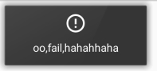

# MyToast
toast的基本封装,包括单例化,成功和失败的提示吐司


# 使用

拷贝demo中提供的包装类MyToast来使用,作为包装层,避免直接使用库内部的类(ToastUtil)


## 提供有以下方法:

```
public static void init( @NonNull Context context, @NonNull Handler mainHandler, boolean isDebugMode){
   ToastUtil.init(context,mainHandler,isDebugMode);
}

public static void showToast(String text){
    ToastUtil.showToast(text);
}

public static void cancelToast() {
    ToastUtil.cancelToast();
}

public static void showDebugToast(final String text) {
    ToastUtil.showDebugToast(text);
}

public static void showLongToast(final String text) {
    ToastUtil.showLongToast(text);
}


public static void showSuccessToast(String text){
    ToastUtil.showSuccessToast(text);
}

public static void showFailToast(String text){
    ToastUtil.showFailToast(text);
}
```

## 成功和失败的自定义吐司的ui:

带有阴影效果

  

